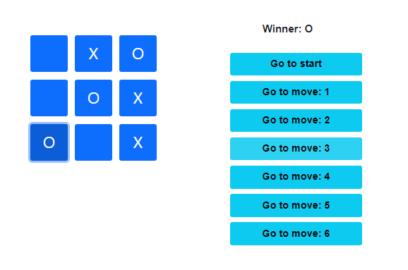

# Tic Tac Toe React

Making a simple tic tac toe game using react with feature of moving to previous moves

## Description

Game uses  following components

* Game
* Board
* Square

## Acknowledgments

This react tutorial helped alot.
* [Tutorial: Intro to React](https://reactjs.org/tutorial/tutorial.html#lifting-state-up-again)